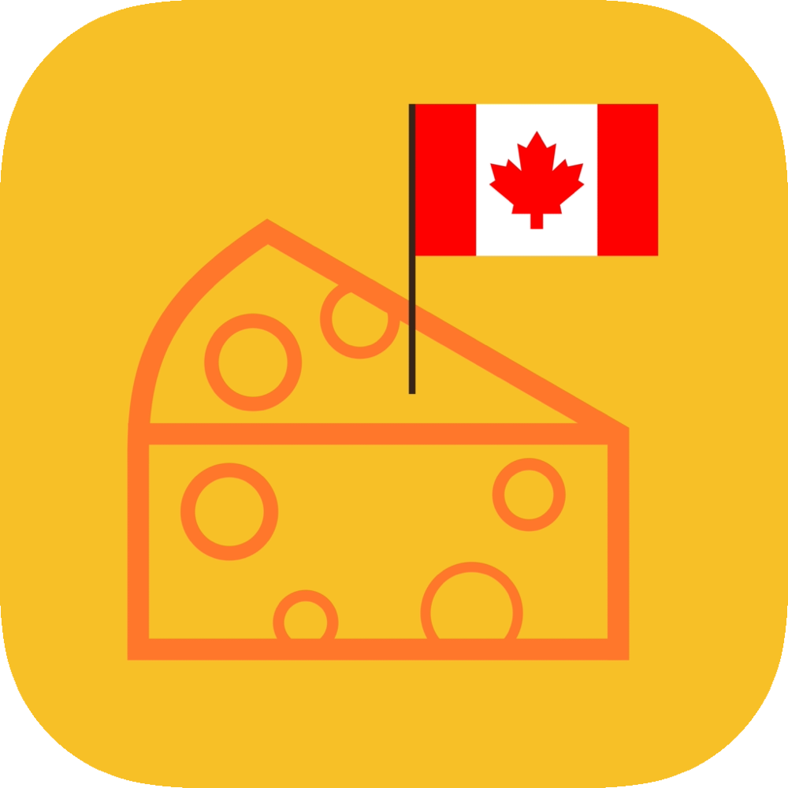

#  Canada Cheese

Canada Cheese is an independent iOS application project I worked on to showcase local Canadian cheese. The app displays the cheese info such as manufacturer’s province, milk type, and moisture content. Cheese data is parsed from a JSON file taken from the Canada Open Government initiative. The app supports filtering, searching, and favouriting cheese, allowing users to find their next favourite cheese based on their personal preferences. Canada Cheese was written in Swift and uses UIKit to display the cheese data. 

|  |  |  |
| - | - | - |

### Here are some screenshots

|  |  |
| ------------- |---------------|
|  |  |
|  |  |
